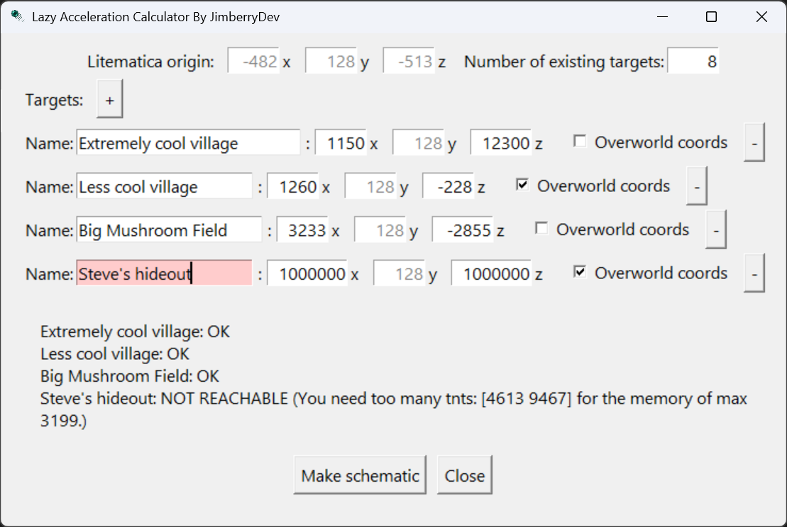

# Lazy Acc Cannon with GUI
The Lazy Acc Cannon is a Minecraft Java 1.21.11+ cannon that allows fast travel across extremely large distances.

- ~500,000 blocks in the Nether
- ~4,000,000 blocks in the Overworld
- ~15 block max error (when built at Y=128)

This works by accelerating an enderpearl using tnt in a lazy loaded chunk, what is known as "lazy acceleration". The amount of tnt for each axis, as well as the direction of is stored in a Read-Only memory (ROM).

It comes with a small desktop tool to generate `.litematic` schematics so you can input locations into the ROM. Just open the .exe, input the cannon origin, the targets' names and coordinates, and click on "Make Schematic". It will ask you where you want to save the generated schematic and under what name.

If you click on the "Overworld coords" checkbox, it will assume the coordinates you input are on the overworld side, and will divide the X and Z coordinates by 8 to get the nether respective coordinates before calculating.

---
## Screenshots




---

## Tutorial

Watch how to use the cannon and tool here:

[Tutorial coming soon on my youtube channel](https://www.youtube.com/@JimberryDev)

---

## Features

- Multiple targets with coordinates
- Automatic TNT calculation per target
- Generates `.litematic` files
- Highlights unreachable targets in the GUI
- Summary output (OK / NOT REACHABLE )
- Remembers last origin and starting ID in a JSON file
- Packaged executable

---

## Installation

### Option 1 — Download executable (recommended)

Download the latest release from:

- [Releases](https://github.com/JimberryDev/Lazy-acc-pearl-cannon-calculator/releases)

Then run `LazyAccCannonCalc.exe`

---

### Option 2 — Run from source

**Requirements**
- Python 3.13.16

Install:

```bash
pip install -r requirements.txt
```

Run:

```bash
python gui.py
```

---
##  Build the cannon

First build the nether side. When doing this, make sure that it is chunk aligned. The trapdoors ontop of lava should be in 4 different chunks. DO NOT ROTATE NOR MIRROR. Then take the schematic origin, multiply the X and Z coordinates by 8 and put the overworld side there. It should connect automatically, but just in case it doesn't, start by building the portals and checkin that it all connects. The entry portal from the nether should lead you to the entry portal on the nether, but sadly the overworld portal brings you to another one in the nether. And the chunk loaders should link to each other.

Make sure to build it in an area where it is improbable someone will load the cannon on the nether side while you use it.

---

##  Usage

### Inputs

- **Litematica origin**
  - Where the base cannon schematic is placed

- **Number of existing schematics**
  - Starting ID for new entries. Here you have to input how many targets you already have in your cannon.

- **Targets**
  - Name (optional)
  - X, Y, Z coordinates
  - Optional: **Overworld coords** (divides by 8 internally)

### Steps

1. Fill origin and starting ID
2. Add one or more targets
3. Click **Make schematic**
4. Choose output `.litematic` path

---

## Output

- A `.litematic` file containing decoder + data slices and repeaters whenever needed
- Only **reachable** targets are included

GUI feedback:
- Unreachable targets are highlighted
- Output shows per-target status and reason

---

## How to use the schematics

- Put the new schematic at the end of your ROM and build it.
- Add the new places to the lecterns on the overworld, starting on the right-most lectern.

## Saved State

The app stores a JSON file with:
- last origin
- last starting ID

File name:

```text
lazy_acc_cannon_gui_state.json
```

Location:
- Source run: next to Python files
- Packaged exe: next to the executable

You can delete this file without repercussions, but it won't remember the cannon's schematic origin.

---

## How it works (high level)

1. Compute trajectory using Minecraft drag + gravity
2. Convert velocity to TNT counts using a change of base, where the motion each tnt would apply is used as a base vector.
3. Encode TNT into the binary layout the cannon requires.
4. Build regions (decoder + data)
5. Merge into final schematic

---

## Project Structure

```text
[project root]
├─ gui.py
├─ slice_schems.py
├─ cannon_calc.py
├─ data_classes.py
├─ src/
│  ├─ Data slice.litematic
│  ├─ Decoder slice.litematic
│  └─ Repeater.litematic
├─ app.ico
└─ [other files]
```

---

## Build (PyInstaller)

Create venv and install:

```bash
py -m venv .venv
.venv\\Scripts\\activate
pip install -r requirements.txt
pip install pyinstaller
```

Create spec:

```bash
pyi-makespec --onefile --windowed --name LazyAccCannon gui.py --add-data "src;src" --add-data "app.ico;." --icon app.ico
```

Build:

```bash
pyinstaller LazyAccCannon.spec
```

Output:

```text
dist/LazyAccCannon.exe
```

Delete `build` if you want to.

---

## Icons

- `.exe` icon is set via `--icon app.ico`
- Window icon is set in code using `root.iconbitmap(...)`
- Ensure `app.ico` is bundled with `--add-data`

---

## Limitations

- Max schematics: `63`
- Max TNT per axis: `3199`
- Precision: about 15 blocks from your target max.

---

## Known Issues

- No known issues yet

---

## Releases

End users should download from:

- [Releases](https://github.com/JimberryDev/Lazy-acc-pearl-cannon-calculator/releases)

---

## Credits
### Author
- JimberryDev
- [Follow me on Youtube](https://www.youtube.com/@JimberryDev)

### Used designs made by other people and link to where I got them from
- *Timing based binary decoder* by **dzreams** from the [Storage Tech archive](https://discord.com/channels/748542142347083868/749136933191549028/997241072164016149) on Discord
- *Hopperspeed Hex to Binary Converter* by **Andrews54757** from the [Storage Tech archive](https://discord.com/channels/748542142347083868/749136933191549028/939047254935896084) on Discord
- *4gt Nimply gate* by **b1nary** from the [Computational Minecraft archive](https://discord.com/channels/959155788092424253/959157573049786458/1016390683478720634) on Discord
- *Binary Counter* by **Crain** from the [Computational Minecraft archive](https://discord.com/channels/959155788092424253/959157573049786458/1016384723578273832) on Discord
- *50 tnt compressor* originally by **@intricate, @enbyd (she | they), @Emir, @DatNerd, @Savva, @Rozbiynik** from a customizable lazy stab grid cannon on the [TNT Archive](https://discord.com/channels/809607812312858684/1218316302784008233/1218316302784008233)
- *Pearl aligner for 1.21.2+* by **[GaRLic BrEd1](https://www.youtube.com/@GaRLicBrEd1)** from the [TNT Archive](https://discord.com/channels/809607812312858684/1342918454465794141/1342918454465794141) on Discord

### Inspiration

When making this, I took severe inspiration in the *360 Lazy Accel Ender Pearl Cannon* from **[WhiteMC](https://www.youtube.com/@WhiteMc-ss7vl)** on [his youtube channel](https://youtu.be/y9iA3AAPDNs). I ended up remaking most of it, but I would not have been able to do it without first learning how he did his version. Thanks for that :)

---

## License
This project is licensed under the terms described in the [`LICENSE`](LICENSE) file.
